# Proteome-wide *ab initio* Structural Analysis of Viral Evolution
#### This github repository serves as a supplement to Chapter 10 of the book 'Evolutionary Genomics' (Methods Molecular Biology, Vol. 2981; Springer Nature) *(Awaiting Publication)*

#### Software used:
1. [Local Colab Fold](https://github.com/YoshitakaMo/localcolabfold) (or latest version of [AlphaFold](https://alphafoldserver.com/welcome))
2. [UCSF Chimera](https://www.cgl.ucsf.edu/chimera/download.html)
3. [AS2TS server](http://proteinmodel.org/AS2TS/LGA/lga.html) used in CASP ([Protopedia Manual](https://proteopedia.org/wiki/index.php/Calculating_GDT_TS))
4. [USAlign](https://www.aideepmed.com/US-align/)
5. [IUPred2A](https://iupred2a.elte.hu/)
6. [Bio3D package in R](https://cran.r-project.org/web/packages/bio3d/index.html)

#### Step-by-step guide of the Methods presented in Section 3 of the chapter: 

## 3.1) AlphaFold Modeling:
LocalColabFold Command:
```
colabfold_batch --amber --random-seed 42 --templates --num-recycle 3 --use-gpu-relax $fasta_file output
```
[Explanation of input flags](https://github.com/YoshitakaMo/localcolabfold?tab=readme-ov-file#flags):
+ --amber: Refine structure through energy minimization.
+ --random-seed: Set random number so that others can reproduce the exact same structure when given the same parameters.
+ --templates: Use templates.
+ --num-recycle: Amount of recycles used for prediction, increasing this may improve quality but reduces speed.
+ --use-gpu-relax: Run on Nvidia GPU instead of CPU (highly recommended).

**Even if you do not use local ColabFold please always specify a random seed or keep the log file that reports the random seed for reproducibility. Additionally a higher num recycle value greater than 6 such as 9 or 12 will not show any significant changes, whereas jumps from 3 to 6 may show improvement in quality (https://academic.oup.com/bioinformaticsadvances/article/3/1/vbad078/7197797) This is context dependent and you should tweak these paramters according to your data*

## 3.2) Structural Validation:
### <ins>Using [LGA_GDT](http://proteinmodel.org/AS2TS/LGA/lga.html) on the [AS2TS server](http://proteinmodel.org/AS2TS/):</ins>
> [!IMPORTANT]
> Before submitting any 3D models of your molecules (PDB or CIF files) you need to superimpose them first to the reference structure which you can do in [Chimera](https://www.cgl.ucsf.edu/chimera/download.html). After superimposing you will need to select each of the molecules one by one and save each selection as a single PDB file. To do this go to [Using UCSF Chimera](https://github.com/gcalab/files/blob/master/Methods%20in%20Molecular%20Biology/Viruses/ReadMe.md#using-ucsf-chimera) and follow it until point 3 (MatchMaker). Then after the structures have been aligned click the 'Select' -> 'Chain' -> (select your desired chain), then click 'Actions' -> 'Write PDB...' -> (input desired filename) -> (select a model to save; you will repeat this for both reference and target) -> make sure to set the `Save relative to model:` as the reference structure.

1. Enter your email and add '-d:4.0' to the end of the default LGA parameters input box. It should look like: `-4 -o2 -gdc -lga_m -stral -d:4.0` <br>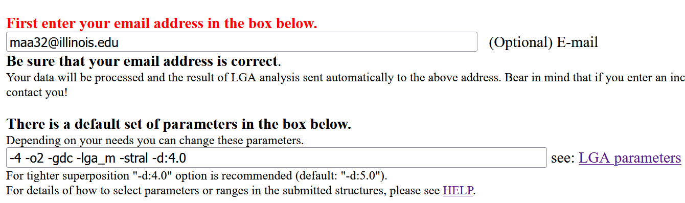
2. Select your desired pdb files for analysis. Set the `Molecule2 no change` to your reference structure and the `Molecule1 to rotate` as your target structure for comparison to your reference. Then click *'START'*. <br>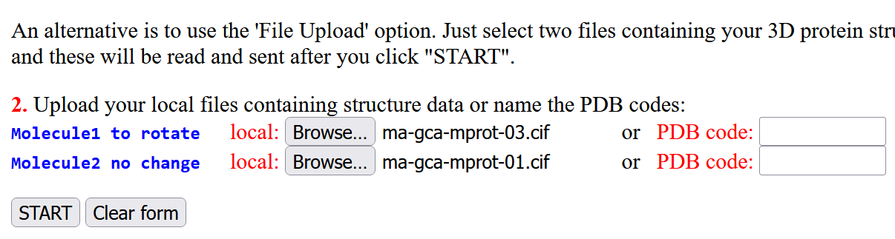
3. Another window will open with the link to where you will get your results. Click the link: *'LGA results'* <br>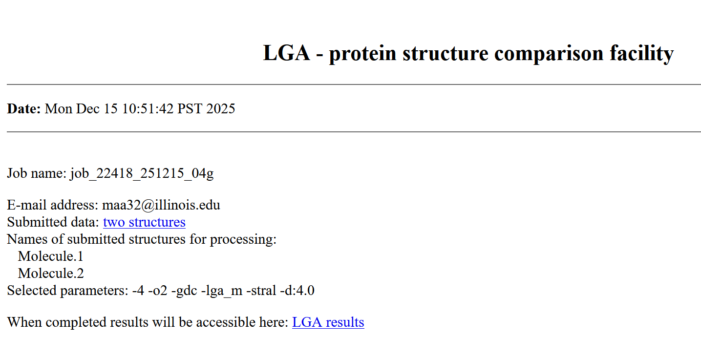
4. The results will open in a new tab. Copy everything to the clip board (press `Ctrl + a` then `Ctrl + c`). <br>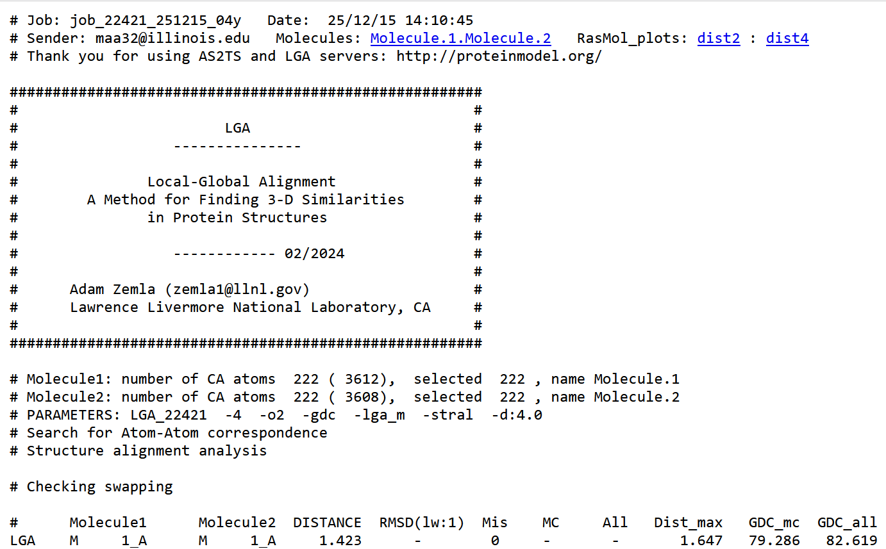
5. Open the AS2TS server ([LGA_GDT](http://proteinmodel.org/AS2TS/LGA/lga.html)) in a new tab and enter your email address agaon followed by some changes to the parameters.
    > In the parameters slot, change -4 to -3, and add -d:4.0  -al at the end. So the complete parameters for Run 2 should be `-3 -o2 -gdc -lga_m -stral  -d:4.0  -al`
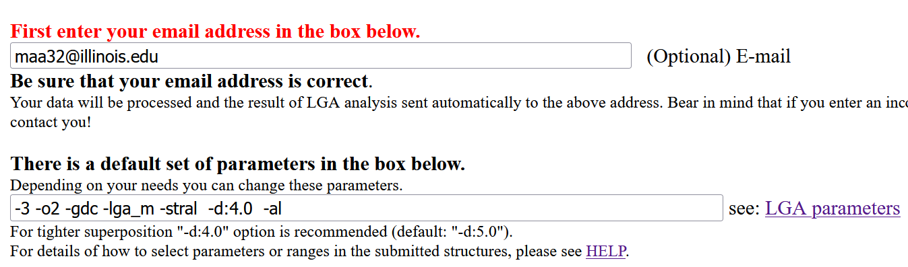
7. Then go to the bottom of the page to box 4 and make sure there is no data/text in boxes 1 to 3 as that will cause the server to ignore anything in Box 4. Paste (Press `Ctrl + v`) the output from LGA Run 1 that you had copied into the textbox of Box 4 and then click *'START'*. <br>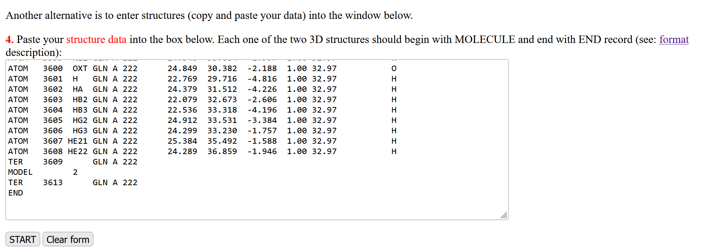
8. A new tab will open that will have a link to the Run 2 results. Click *'LGA results'* <br>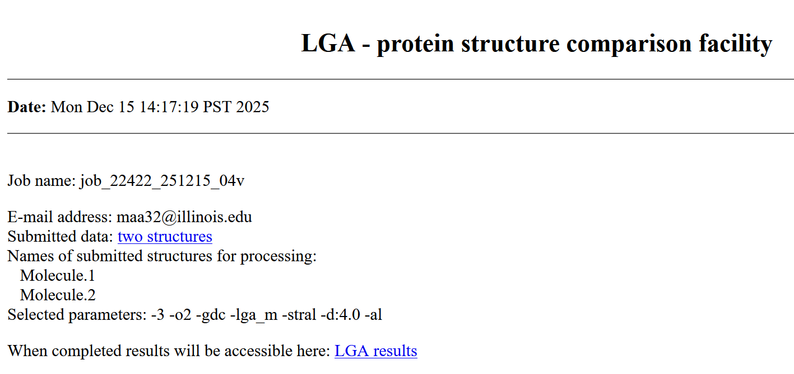
9. You now have the final result output from LGA. You can save this to a text file. <br>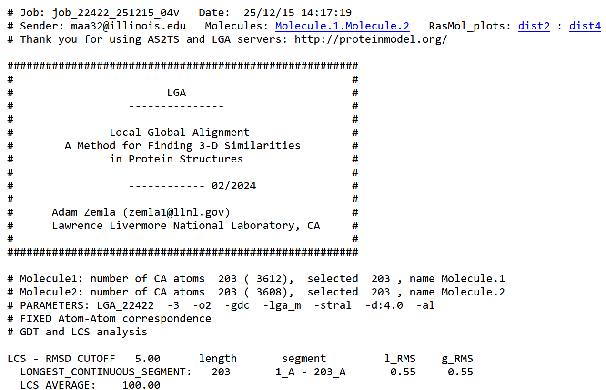
10. The information that you need is deep within the file noted by lines that start with `# RMSD_GDC results:` and `#CA`. An easy way to find this would be to search the file using `Ctrl + f` and type in '# RMSD_GDC results:' into the look up search bar.
    - To calculate the true Global Distance Test Score (GDT_TS) you will need the data from columns GDT_TS and NUMBER_OF_ATOMS_AA.
    - In this example below, the GDT_TS score is 99.261 and the NUMBER_OF_ATOMS_AA is 203. The total number of atoms for the reference structure used in this example was 222 (which you can find in the output of Run 1 as seen in point 4 above).
    - Input these numbers into the following equation:
                <br>i) `True GDT_TS = GDT_TS * (NUMBER_OF_ATOMS_AA / Total Atoms of Reference Molecule)`
                <br>ii) `True GDT_TS = 99.261 * (203/222) = 90.766`<br>
      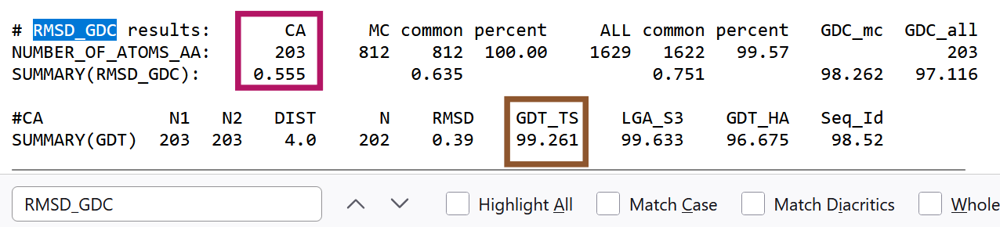
    - You can report findings either just as a stand alone value or calculate the GDT_TS for multiple states of a protein such as the closed and open state of the SARS-CoV-2 Spike protein or test similarity of AlphaFolded monomer to each monomer chain of an experimentally resolved SARS-CoV-2 Spike trimer. [Reference](https://www.mdpi.com/2079-7737/13/3/134#biology-13-00134-t002)

## 3.3) Mutant Structure Comparison:
### <ins>Using UCSF Chimera:</ins>
1. After opening your desired PDB/CIF files in the same Chimera session. Select the *'Tools'* option from the top navigation bar. <br>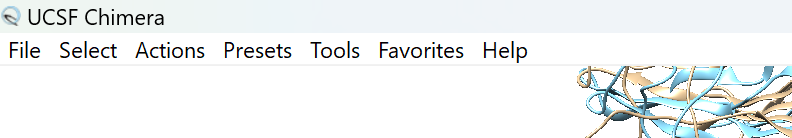
2. The *'Tools'* drop down menu will open and then select *'Structure Comparison'* -> *'Match Maker'* <br>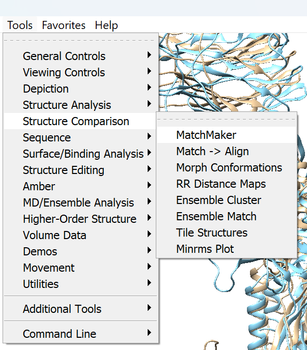 'Structure Comparison' -> 'Match Maker'" style="width:50%; height:auto;">
3. A new window will open where you will choose which structure is your reference and which one will be matched to the reference. Enable *Show pairwise alignments(s)* but keep everything else at default settings. <br>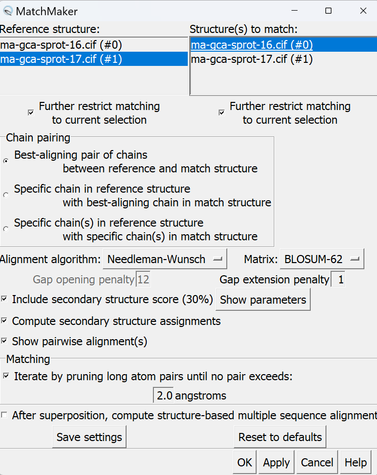
4. After that you can additionally run *Match Align* also found in *'Tools'* -> *'Structure Comparison'*. This will show a Multiple Structure Alignment which is useful to visually see the structural deviations along the length of the protein sequence and can be a quick way to find out regions of interest. <br>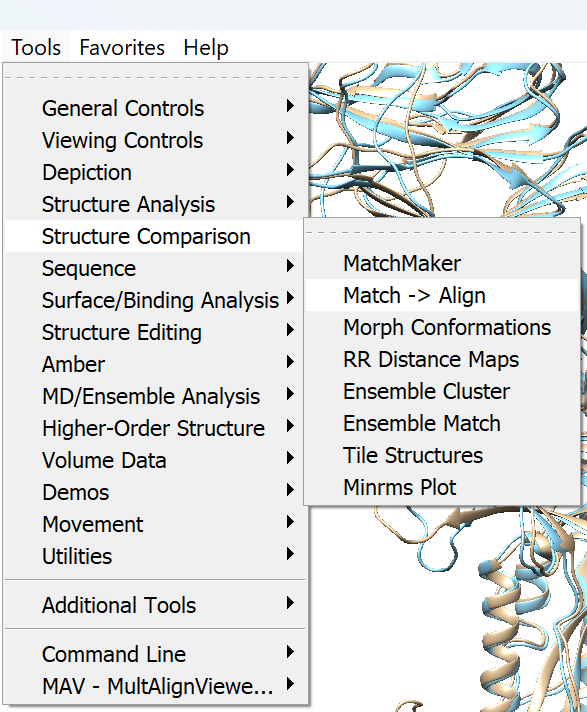 'Structure Comparison' -> 'Match Align')" style="width:50%; height:auto;">
5. From the Pairwise Alignment option in *Match Maker* a MultiAlignViewer window will open, where you will see a *'Headers'* option in the top navigation bar. Clicking this will reveal a drop down and you can select *'RMSD:backbone'* to only retain the RMSD values of the backbone atoms (or you can chnage this according to your needs). After this you can save the RMSD headers to a text file by clicking the *'Save...'* option from the *'Headers'* dropdown list. <br>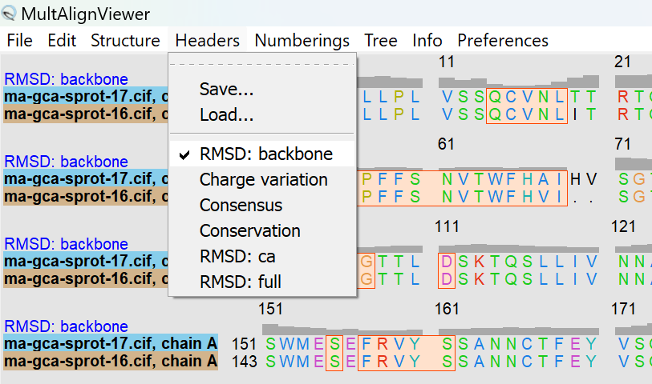
6. A new window will open which will prompt you to type out the name and path for the RMSD header file. <br>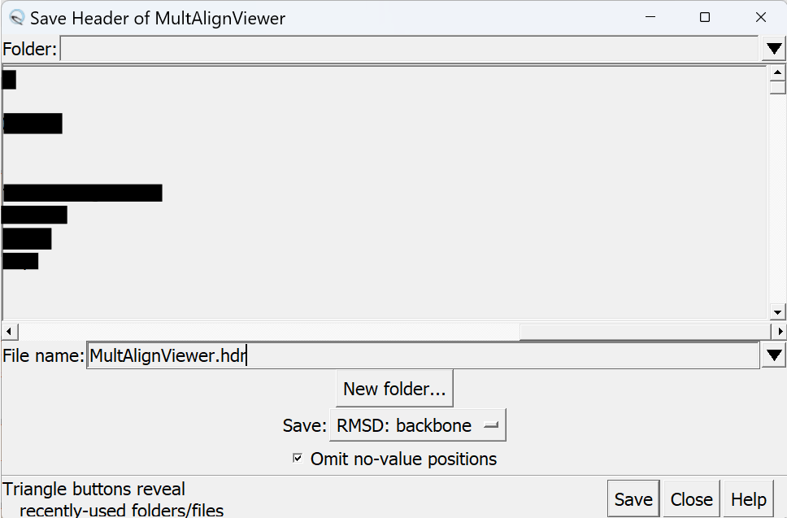
7. This is how the RMSD header file looks like, you will need to parse it line by line or use one of the scripts in this repo to extract position wise RMSD values. <br>

<ins>You can visualize the RMSD Headers for each of your protein structures as a heatmap:</ins> <br>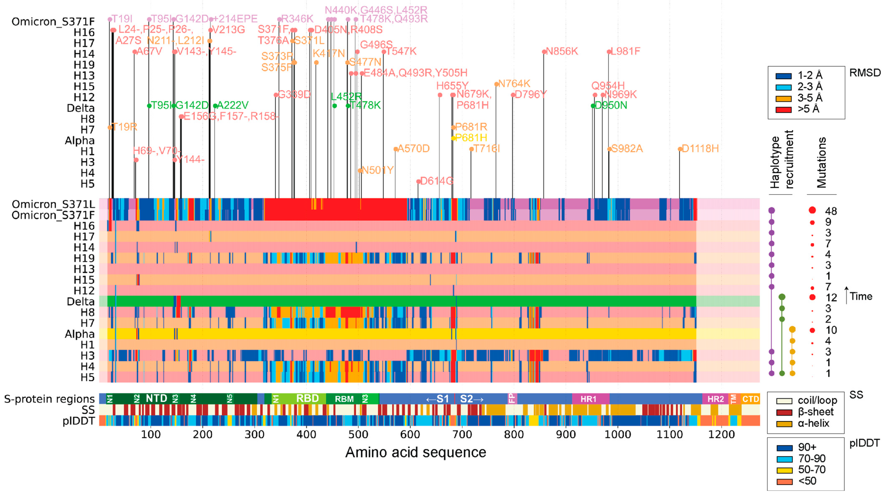
> Figure 1. Regions of structural deviation (measured in RMSD). The vertical axis represents each of the haplotypes and variants discussed in this paper arranged in chronological order from earliest to latest, up until the appearance of VOC Omicron. The horizontal axis represents the amino acid positions along the length of each of the S-protein molecules. The horizontal bars representing the haplotypes and VOC constellations are colored in hues of light coral and sandy brown in an alternating fashion, whereas VOCs Alpha, Delta, and Omicron are colored yellow, green, and purple, respectively. When a residue along the length of any of these protein molecules crosses the 1 Å, 2 Å, 3 Å, and 5 Å RMSD, then that position is colored in dark blue, light blue, orange, and red, respectively. The horizontal bar labeled ‘S-protein regions’ indicates all positions of important regions/domains along the S-protein. The horizontal bar labeled SS indicates the position of alpha helices (brown), beta sheets (dark red), and coils (beige). The horizontal bar labeled plDDT represents the confidence level of AlphaFold2 for each residue along the S-protein. On top of the graph are the individual mutations that make up each of the haplotypes and variants. Note that free-standing mutations are not modeled independently but are included and marked in the variant on this graph. Table S1 lists VOCs and haplotypes and their associated mutations. [Reference](https://www.mdpi.com/2079-7737/13/3/134#biology-13-00134-f001)


<ins>Gather information of regions cross an RMSD threshold of your choice and slice them out into smaller PDB files like this:</ins> <br>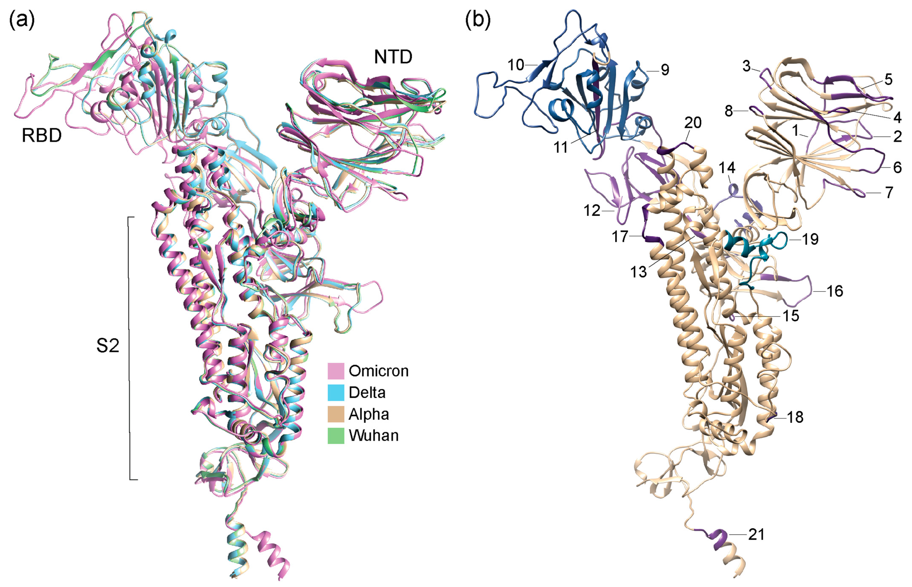
> Figure 3. Structural models of S-proteins with regions of structural change (region 1 to 21 as identified in Figure 2) mapped onto them and colored according to TM scores from US-align and Chimera alignments. (a) Structural alignment of AlphaFold2-modeled structures of VOCs and Wuhan reference strain. (b) Structural model of VOC Omicron. Numbers indicate regions of structural change. [Reference](https://www.mdpi.com/2079-7737/13/3/134#biology-13-00134-f003)


<ins>These regions can then be sliced out of the original PDB file and then analyzed separately using US-align:</ins> <br>
> Figure 2. Three-dimensional (3D) models of molecular change at the atomic level in regions of structural deviation. Using the data from Figure 1, all residues that surpassed the 3 Å threshold were translated into 21 regions of structural deviation. Model snapshots of these regions were taken in Chimera to ensure all of the superimposed structures and their corresponding residues were adequately captured for each region. The location of regions in the amino acid sequence is indicated in red. Each variant and haplotype structure is color-coded according to the bottom-left index. [Reference](https://www.mdpi.com/2079-7737/13/3/134#biology-13-00134-f002)

### <ins>Using BioPDB to slice out regions along a protein:</ins>

Code snippet to slice out portions of a PDB file to allow regional analysis of structural deviation. Adapted from an [answer](https://stackoverflow.com/a/22453336) by [Juniper-](https://stackoverflow.com/users/899470/juniper) on [Stack Overflow](https://stackoverflow.com/questions).
```
import Bio.PDB as bpdb

s = bpdb.PDBParser().get_structure('temp', og_pdb) #Retrieve target PDB file; parameters: id, file location
#Selecting residue position 4 to 62 from chain A
start_res = 4 #or you can set this from the command line
end_res = 62 #or you can set this from the command line
chain_id = 'A' #or you can set this from the command line

class ResSelect(bpdb.Select):
    def accept_residue(self, res):
      if res.id[1] >= start_res and res.id[1] <= end_res and res.parent.id == chain_id:
        return True
      else:
        return False

io = bpdb.PDBIO() #Instantiate PDBIO object
io.set_structure(s) #Give it the PDB we want sliced
new_name = 'your desired name for the sliced region'
io.save(out + region + '/' + new_name, ResSelect()) #example output path that saves regions (e.g: region1, region2, in a directory) and uses ResSelect to slice out desired region before saving the structure
```

### <ins>Using US-align to analyze regional structural deviations:</ins>

Please download US-align to incorporate it with the scripts in this repo and for automation. After you have your sliced regions you will need to analyse them further using [US-align](https://www.aideepmed.com/US-align/). 
This can be achieved in two ways: 1) With Superposition and 2) Without Superposition.

##### With Superposition (Does not use *'-se'*)
```
USalign -dir1 path/to/pdbs/mutant.pdb path/to/pdbs/file/list.txt path/to/pdbs/reference.pdb > output_folder/results_se.txt
```
##### Without Superposition (Uses *'-se'*)
```
USalign -se -dir1 path/to/pdbs/mutant.pdb path/to/pdbs/file/list.txt path/to/pdbs/reference.pdb > output_folder/results_no_se.txt
```
[Explanation of Input Flags:](https://www.aideepmed.com/US-align/help/)
> -dir1: Use chain2 to search a list of PDB chains listed by 'chain1_list' under 'chain1_folder'. Note that the slash is necessary. e.g: USalign -dir1 chain1_folder/ chain1_list chain2

> -se: Do not perform superposition. Useful for extracting alignment from superposed structure pairs

The ` > ` from the command above (` > output_folder/results_no_se.txt`) will save the result outputted by US-align to the terminal window into a text file at your desired location.

The final result will have all the outputs for the proteins you are analyzing into one file. You will need to parse this file to get region wise TM scores for further analysis. The resulting file/output will look something like this:
<br>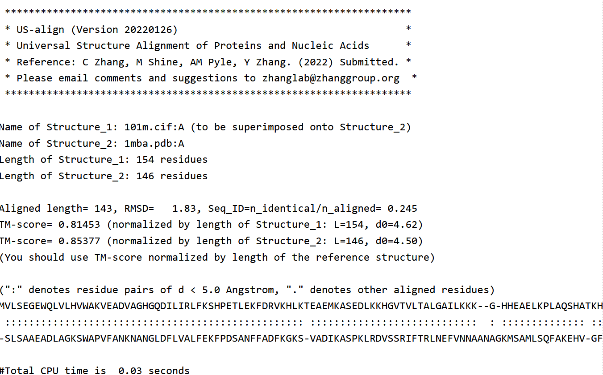

Example of how you can visualize the results from US-align as a heatmap for both with and without superposition (for any number of proteins you wish to analyze): <br>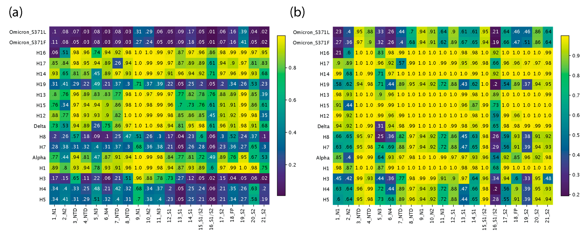
>Figure 4. Heatmap of TM scores (ranging from 0 to 1) of regions of structural change. The 21 regions of structural change that we identified were used to slice the corresponding regions from each file and obtain TM scores for each VOC and haplotype with USalign, using the Wuhan reference molecule as the template. The vertical axis is arranged in chronological order, depicting changes across the timeline of the pandemic, and the horizontal axis represents the 21 regions described in Figure 2. All TM scores falling under the TM threshold of 0.5 are colored in white. (a) TM scores using alignments from Chimera superimposition. (b) TM scores using USalign alignments. [Reference](https://www.mdpi.com/2079-7737/13/3/134#biology-13-00134-f004)

## 3.4) Mapping Intrinsic Disorder and Binding Capability:
### <ins>Using IUPred for analyzing intrinsic disorder and binding capability:</ins>

1. Navigate to the [IUPred3 website](https://iupred3.elte.hu/) <br>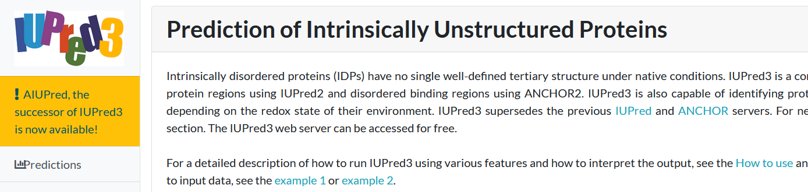

2. Paste your proteins amino acid sequence into the text box or upload the fasta file. After inputting your data. Select the paramters that best fit your needs. You will need to run this twice once for obtaining the IUPred3 scores and once for ANCHOR2 scores. Then press the *'Submit'* button to run your sequence. To choose between long and short look at this [explanation](https://iupred3.elte.hu/help_new). This study uses hsort disorder to emphasize local/regional differences instead of the overall protein. <br>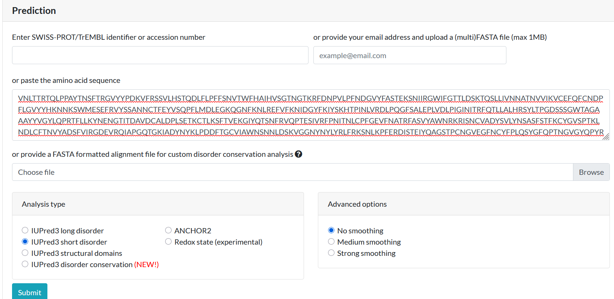

3. Download your results from the resulting landing page (Select text file if you want to use the scripts in this repository). Using Python you can the per position scores into an array for analysis or visualization. This is what the results will look like: <br>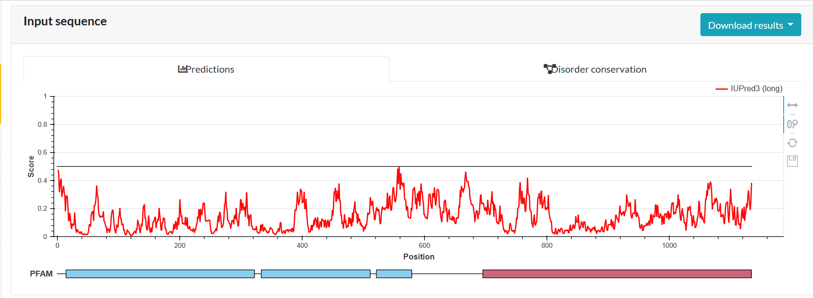 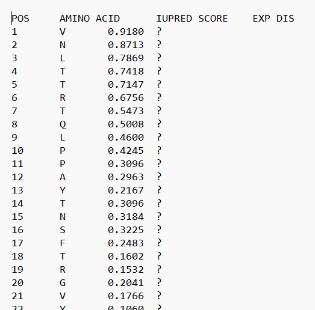

5. Below is an example of how you can visualize IUPred and ANCHOR2 scores of your proteins. <br>
>Figure 5. Intrinsic disorder and binding capability across the pandemic. [Reference](https://www.mdpi.com/1999-4915/16/9/1358#viruses-16-01358-f005)

### <ins>Normal Mode Analysis (NMA) using [Bio3D](http://thegrantlab.org/bio3d/) in [R](https://www.r-project.org/):</ins>
First you must [Install](http://thegrantlab.org/bio3d_v2/tutorials/installing-bio3d) Bio3D.
> On all platforms (Mac, Linux, and PC) open R (version 3.1.0 or higher) and use the function install.packages() at the R command prompt to install the package from your local CRAN site:

> `install.packages("bio3d", dependencies=TRUE)`

> Alternatively, if you prefer to use RStudio, select Tools → Install Packages.., Enter bio3d in the Packages text box (and make sure Install Dependencies is selected). Then click Install.

R code below: 

```
library('bio3d') #Import the Bio3D library

pdbfiles <- list.files(pattern="*.pdb", full.names=TRUE) #Retrieve list of target PDB files

#Iterate through the PDB files
for (x in pdbfiles){
  pdb <- read.pdb(x) #Read files into a PDB object
  modes <- nma(pdb) #retrieve the normal modes for the PDB file into  a variable called modes
  fluctuations <- modes$fluct #Retrieve the fluctuation values into  a variable called fluctuations

  name <- gsub("[./pdb]", "", x) #get name of pdb file (remove the '.pdb' from file name using gsub)
  n <- paste("out/",name,".csv", sep="") #concatenate PDB file name into a desired output path location and file type using paste
  write.csv(fluctuations, file = n, row.names =FALSE) #write the fluctuations into a csv file with the new name
}
```
Example of how how you can visualize the fluctuations and the first non trivial normal mode of different proteins: <br>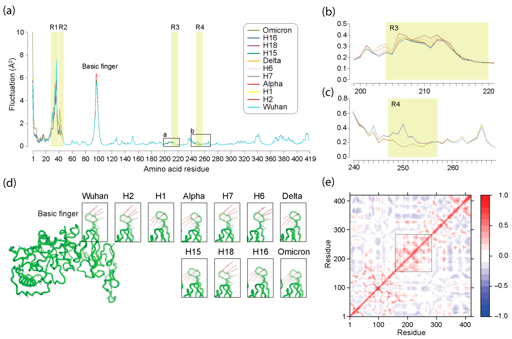
> Figure 6. Normal mode analysis (NMA) of the N-protein across the pandemic. (a) Atomic fluctuation of residues mapped along the amino acid sequence of the N-protein for haplotypes and VOCs. Regions of structural change (R1, R2, R3, and R4) are shaded in light yellow, and the location of the nucleic acid-binding ‘basic finger’ is identified. (b,c) Details of plots in regions surrounding the R3 and R4 regions. (d) Visualization of the first non-trivial mode (mode 7) of the Wuhan N-protein molecule reflecting optimal energy states using a vector field representation. The most salient motion pattern in the ‘basic finger’ is highlighted and unfolded for all haplotypes and VOCs, showing notable changes in motion directionality. (e) A dynamic cross-correlation heat map for the Wuhan molecule averaged over all modes show correlated (red hues) and anti-correlated (blue hues) regions in the protein structure. Big and small boxes highlight the positively correlated LKR sequence embedding the R1 and R2 regions and the ‘basic finger’, respectively. [Reference](https://www.mdpi.com/1999-4915/16/9/1358#viruses-16-01358-f006)

## 3.5) Downstream Analysis:

<ins>Examples of the kinds of analyses you can carry out:</ins>

1. https://f1000research.com/articles/12-267
2. https://www.mdpi.com/2079-7737/13/3/134
3. https://www.mdpi.com/1999-4915/16/9/1358
4. https://www.ideals.illinois.edu/items/131533
