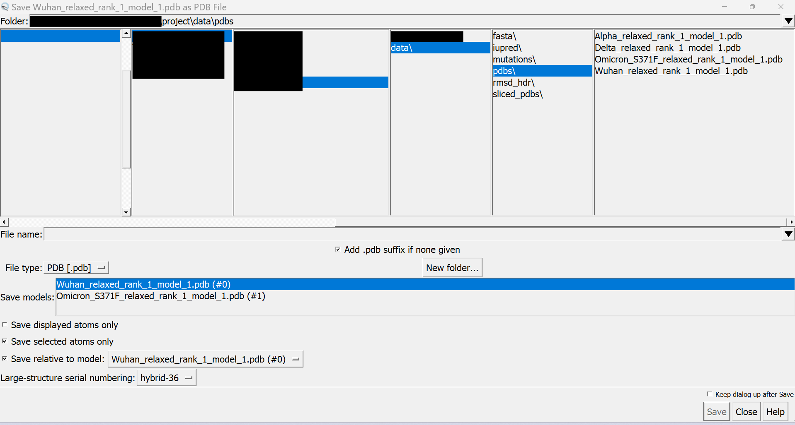

# Superimposing Structures in UCSF Chimera
> [!NOTE]
> This is the guide for superimposing structures in Chimera and saving the PDB files after superposition for further analysis either for [Structural Validation](https://github.com/gcalab/files/blob/master/Methods%20in%20Molecular%20Biology/Viruses/ReadMe.md#32-structural-validation) using [LGA](http://proteinmodel.org/AS2TS/LGA/lga.html) or before [slicing out PDB regions for analysis](https://github.com/gcalab/files/blob/master/Methods%20in%20Molecular%20Biology/Viruses/ReadMe.md#using-biopdb-to-slice-out-regions-along-a-protein) with [US-align](https://aideepmed.com/US-align/).

1. Go to `Tools` -> `Structure Comparison` -> `MatchMaker` (Click)  

2. New `MatchMaker` window opens. Select your reference structure only in the `Reference structure` column and all others in the `Structure(s) to match:` column and select `Further restrict matching to current selection` for both columns. Then keeping everything else constant, also select `Show pairwise alignments` and `After superposition, compute structure based multiple sequence alignment` then click `Apply`. Wait for processing, multiple windows for pairwise alignments will open and new window prompt for the multiple sequence alignment (MSA) will pop up.  

3. For the structure based MSA, keep the default settings or change according to your requirements and click `Apply'. Wait a while and the MSA will be computed and open in a new window.  

4. After alignmnet your structures are superimposed and you can now save the superimposed structure PDBs. You will need to repeat this step for all the structures that you have. Go to `Select` -> `Chain` -> [select your desired model/structure]. Your selected structure should have been highlighted in a bright green color (or your set selection color).  

5. Then go to `Actions` -> `Write PDB...`. A new window will pop up prompting you to save the file with additional settings that you WILL have to change from default.  

6. In the Save PDB File window set the desired file name and location. Make sure the `File type` field is set to `PDB[.pdb]` and then select which model to save. After that make sure the `Save displayed atoms only` is UNSELECTED and make sure that `Save selected atoms only` is selected and that you are saving each model relative to your reference structure (`Save relative to model: `[choose your reference structure]). Now you can hit save and you should repeat these steps for all of your models.  
