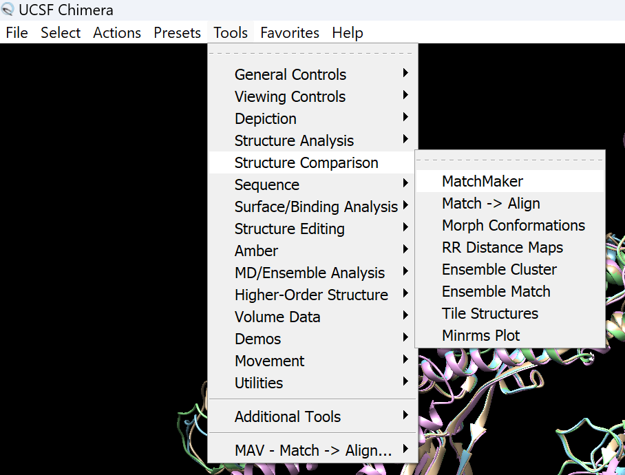
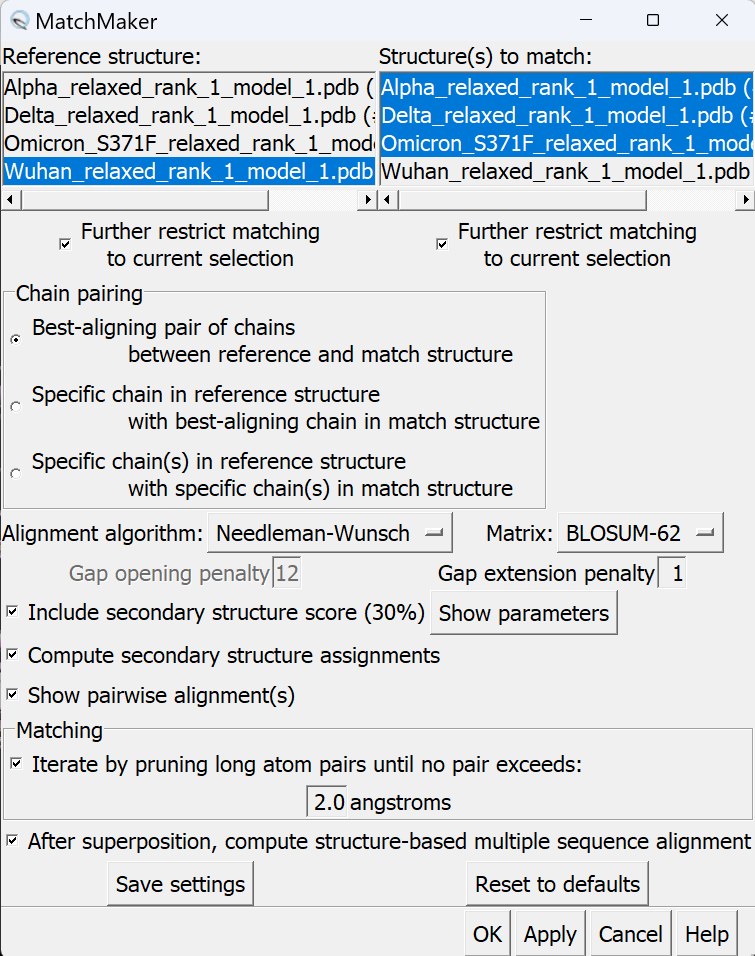
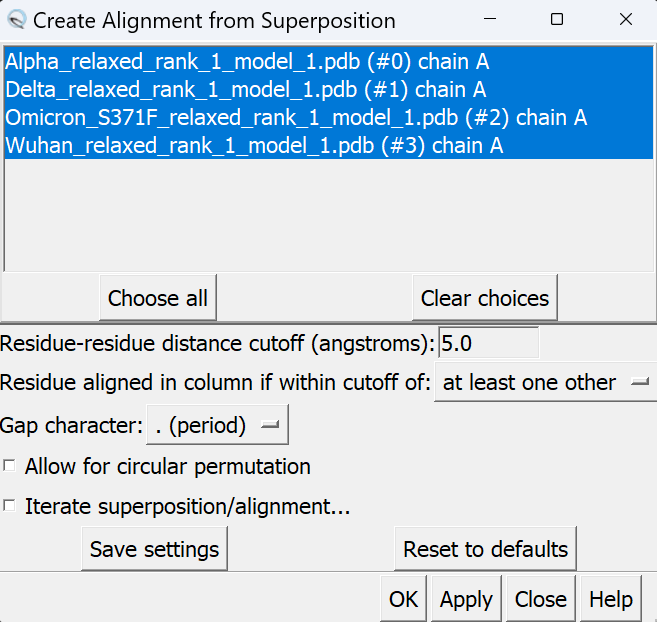
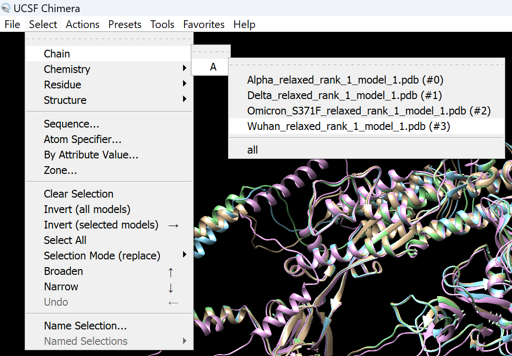
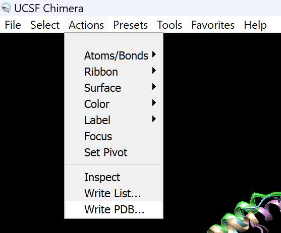

# Superimposing Structures in UCSF Chimera
> [!NOTE]
> This is the guide for superimposing structures in Chimera and saving the PDB files after superposition for further analysis either for [Structural Validation](https://github.com/gcalab/files/blob/master/Methods%20in%20Molecular%20Biology/Viruses/ReadMe.md#32-structural-validation) using [LGA](http://proteinmodel.org/AS2TS/LGA/lga.html) or before [slicing out PDB regions for analysis](https://github.com/gcalab/files/blob/master/Methods%20in%20Molecular%20Biology/Viruses/ReadMe.md#using-biopdb-to-slice-out-regions-along-a-protein) with [US-align](https://aideepmed.com/US-align/).

1. 
2. 
3. 
4. 
5. 
