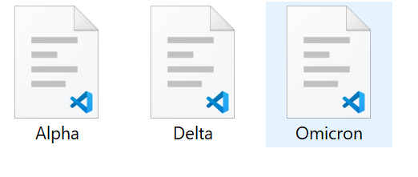
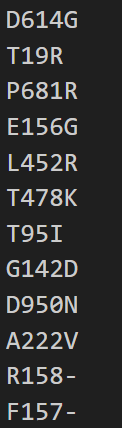
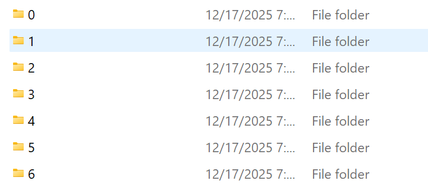
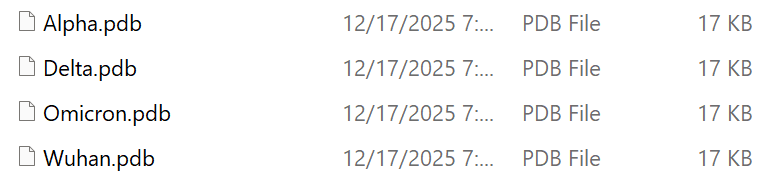

# Project Structure & Files
> [!NOTE]
> You should install the requirements using the following command: `pip install -r requirements.txt`
> The requirements.txt file was generated using: `pipreqs project` (folder folding containing only py scripts)
### Data Folder
```
/data
├──/fasta
|  └── #contains original fasta file and mutated fasta file after running get_mut_fasta() from main.py
├──/iupred
|  └── #contains results from IUPred3
├──/mutations
|  └── #contains csv files containing mutation data in 'D614G' format, line separated
├──/pdbs
|  └── #contains superimposed pdb files for target pporteins
├──/rmsd_hdr
|  └── #contains RMSD headers after running MatchMaker in Chimera
└──/sliced_pdbs
   └── #contains directory of directories with internal dirs named 0,1,... representing identified regions of structural deviation; sliced up regions of the pdb files in the pdbs/ folder using RMSD header data after running get_slices() from main.py
```
### Scripts
#### Callable functions of functions.py:

1.   get_mut_fasta(fasta_path, mut_path, out_path)
     - Needs: location to fasta file, mutation file, and a path to the output folder
     - The input mutations folder and file should look like:
       - 
       - 
     - This will generate fasta files incorporating mutations provided in csv (look at example for formatting mutation file)
     - example of fasta file content:
       - `MFVFLVLLPLVSSQCVNLTTR...SCGSCCKFDEDDSEPVLKGVKLHYT`

3.   get_rmsd_hdr(folder)
     - Needs: path to folder
     - This will process the RMSD headers for visualization (reads file data into array)
     - Returns list of labels and list of headers like this:
       - labels: `['alpha.hdr', 'delta.hdr', 'omicron.hdr']`
       - headers: `[array([16.4208 , 16.1124 , 13.7371 , ...,  9.11682,  9.89912, 10.2027 ],shape=(1270,)),
           array([12.9343 , 12.0993 , 11.3014 , ...,  6.1363 ,  6.26319,  6.21893],shape=(1271,)),
           array([ 3.8281 ,  3.97543,  4.18576, ..., 61.346  , 66.0447 , 66.6376 ],shape=(1265,))]`
         
4.   get_regions(rmsd_vals, threshold)
     - Needs output from get_rmsd_hdr() and user defined threshold (reccomended value: 3.0)
     - This will get regions of structural deviation using RMSD header data based on a threshold, it will return a list of tuples containing the start and end position of regions that have RMSD greater than defined threshold like this:
       - `[(0, 12), (18, 22), (65, 71), (107, 107), (117, 118), (139, 145), (149, 155), (163, 174), (202, 205), (307, 582), (614, 615), (617, 618), (631, 631), (648, 649), (668, 680), (748, 748), (823, 823), (833, 837), (972, 973), (975, 976), (1135, 1270)]`

5.   get_slices(regions,pdb_folder, chain, output)
     - Needs: output from get_regions(), path to slice_pdb folder, what chain you want sliced (check chain id in Chimera), path to output folder
     - This will slice of regions identified from get_regions() into the sliced_pdbs/ folder and the out looks like this:
       - The output folder the directories for each region: <br>
       - An individual region folder with sliced pdbs: <br>

6.   get_iupred(folder)
     - Needs: path to folder with IUPred3 files
     - This will process the IUPred3 output files for visualization and returns, labels, disorder scores, and binding scores
       - labels: `['Alpha.txt', 'Delta.txt', 'Omicron.txt', 'Spike_Wuhan.txt']`
       - disorder: `[array([0.0031, 0.0008, 0.0021, ..., 0.073 , 0.0386, 0.0222], shape=(1270,)),
                     array([0.0023, 0.0011, 0.0022, ..., 0.073 , 0.0386, 0.0222], shape=(1271,)),
                     array([ 0.0038, -0.0005,  0.    , ...,  0.073 ,  0.0386,  0.0222], shape=(1267,)),
                     array([0.0028, 0.001 , 0.0023, ..., 0.073 , 0.0386, 0.0222], shape=(1273,))]`
       - bindings: `[array([0.1316, 0.1302, 0.13  , ..., 0.0231, 0.022 , 0.0198], shape=(1270,)),
                     array([0.1173, 0.1156, 0.1154, ..., 0.0231, 0.022 , 0.0198], shape=(1271,)),
                     array([0.028 , 0.0276, 0.0278, ..., 0.0231, 0.022 , 0.0198], shape=(1267,)),
                     array([0.133 , 0.1316, 0.1314, ..., 0.0231, 0.022 , 0.0198], shape=(1273,))]`
         
7.   get_tm_scores(tm_path)
     - Needs: path to tm score folder
     - This will process the output files from USalign and return a dictionary holding lists of tuples with regional TM scores like this:
       - `se_region_1_OUTPUT.txt:
[('Wuhan_Alpha', 0.77419), ('Wuhan_Delta', 0.72706), ('Wuhan_H1', 0.88681), ('Wuhan_H12', 0.87898), ('Wuhan_H13', 0.79785), ('Wuhan_H14', 0.92601), ('Wuhan_H15', 0.7618), ('Wuhan_H16', 0.0562), ('Wuhan_H17', 0.85074), ('Wuhan_H19', 0.30694), ('Wuhan_H3', 0.16518), ('Wuhan_H4', 0.33909), ('Wuhan_H5', 0.33604), ('Wuhan_H7', 0.27892), ('Wuhan_H8', 0.19799), ('Wuhan_Omicron_S371F', 0.11269), ('Wuhan_Omicron_S371L', 0.10173)]`

> [!TIP]
> You should call functions according to your requirements in main.py and customize your workflow to where you are in the process when following the guide for [Proteome-wide ab initio Structural Analysis of Viral Evolution](https://github.com/gcalab/files/blob/master/Methods%20in%20Molecular%20Biology/Viruses/ReadMe.md)
